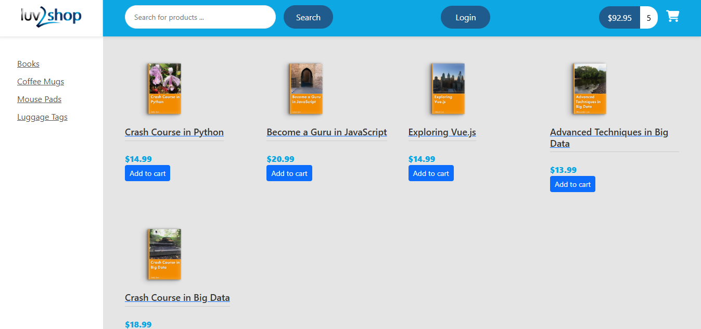
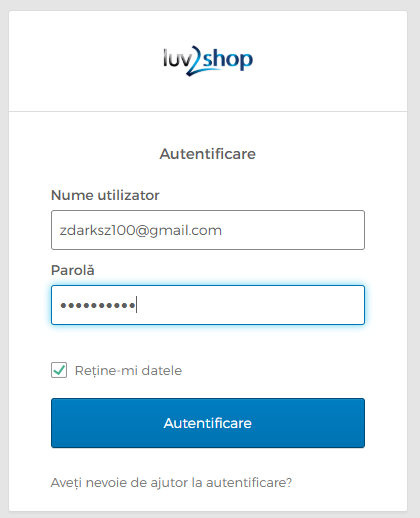
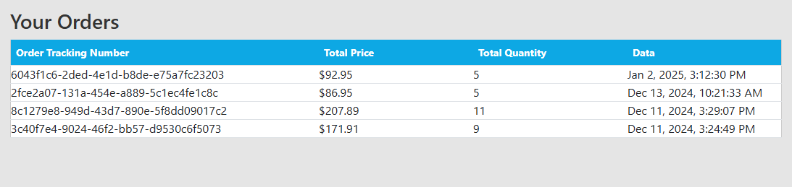
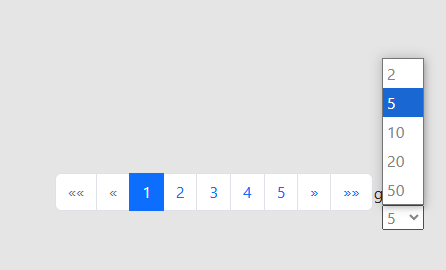
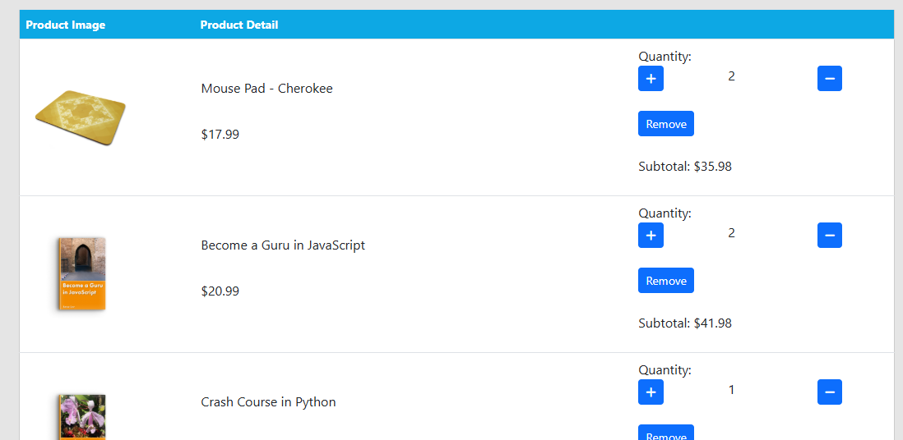
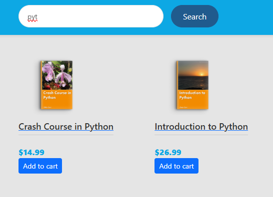
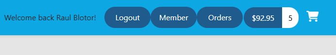
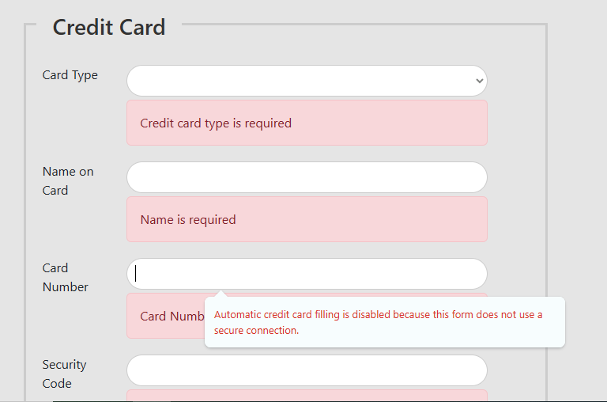
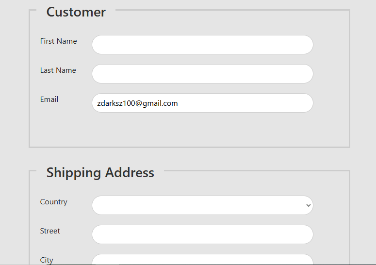

# Luv2Shop eCommerce Platform

Luv2Shop is a full-stack eCommerce application designed for modern online shopping experiences. It combines a robust backend built with **Spring Boot** and **MySQL** with a dynamic frontend developed using **Angular**. This platform provides a seamless experience for users to browse, purchase products, and manage their shopping experience.

---

## Features

### Core Functionality
- **User Roles:**
  - **Visitors:** Can browse products and subscribe to newsletters.
  - **Registered Users:** Can manage profiles, place orders, and view order history.
  - **Administrators:** Manage the platform, including product catalogs and user accounts.
- **Comprehensive Product Management:** 
  - View product details.
  - Add, update, or delete items from the catalog (admin-only).
- **Shopping Cart:**
  - Add, modify, and remove products from the cart.
  - View subtotal and total amounts in real-time.
- **Order Management:**
  - Secure checkout process with validation for shipping and billing details.
  - Payment integration for online and cash-on-delivery options.
  - Track orders with a unique order ID.
- **Authentication and Security:**
  - Secure user authentication with **Okta** integration.
  - Protected endpoints using Spring Security.

---

## Screenshots

### Home Screen
The home screen displays a product catalog with categories, search functionality, and an interactive shopping cart.


### Login Page
The login page ensures secure access for registered users with the option to remember login details.


### Order History
View all completed orders with tracking details, total price, quantity, and date.


### Pagination
Efficiently browse through large product catalogs using pagination with customizable items per page.


### Shopping Cart
A detailed view of the shopping cart showing products, quantities, subtotals, and options to update or remove items.


### Search Functionality
Search for products dynamically using keywords to filter results instantly.


### Successful Login
A personalized dashboard appears after a successful login, welcoming the user and providing access to their orders and account.


### Product Details
View detailed descriptions of a selected product, including its price and option to add it to the cart.


### Empty Form Validation
Forms are validated dynamically, highlighting required fields to ensure accurate data submission.


### Checkout Form
The checkout form captures user information securely, ensuring valid shipping and payment details are provided.


---

## Architecture

### Backend
- **Spring Boot:** Provides the RESTful API for the application.
- **MySQL:** Handles data storage for users, orders, and products.
- **Spring Data JPA:** Simplifies database operations and ensures secure and efficient data handling.
- **Spring Security:** Ensures secure authentication and authorization.

### Frontend
- **Angular:** Delivers a responsive and interactive user interface.
- **Dynamic Forms:** Provides validation for checkout and registration forms.
- **State Management:** Handles cart operations and persists data for a seamless shopping experience.

### Data Flow
1. **User Interaction:** Users interact with the Angular frontend for product browsing, cart management, and checkout.
2. **API Communication:** The frontend communicates with the Spring Boot backend via RESTful APIs.
3. **Database Management:** Backend processes requests, interacts with the MySQL database, and returns structured responses to the frontend.

---

## Setup Instructions

### Prerequisites
- **Java 17** or higher
- **Node.js 14+**
- **MySQL** database
- **Angular CLI**

### Steps
1. **Backend:**
   - Configure `application.properties` with your MySQL credentials.
   - Run the Spring Boot application:
     ```bash
     mvn spring-boot:run
     ```
2. **Frontend:**
   - Navigate to the Angular project folder.
   - Install dependencies:
     ```bash
     npm install
     ```
   - Run the development server:
     ```bash
     ng serve
     ```
   - Access the application at `http://localhost:4200`.

3. **Database:**
   - Set up the MySQL schema and seed initial data as required.
   - Verify API endpoints using tools like Postman.

---

## Contribution
Feel free to contribute to the project by creating pull requests. Follow the standard guidelines for code formatting and documentation.

---

## License
This project is open-source and available under the MIT license.
